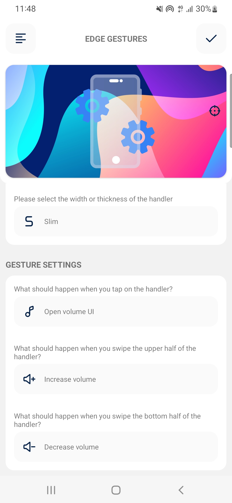
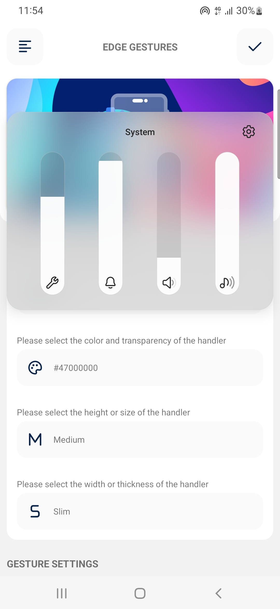
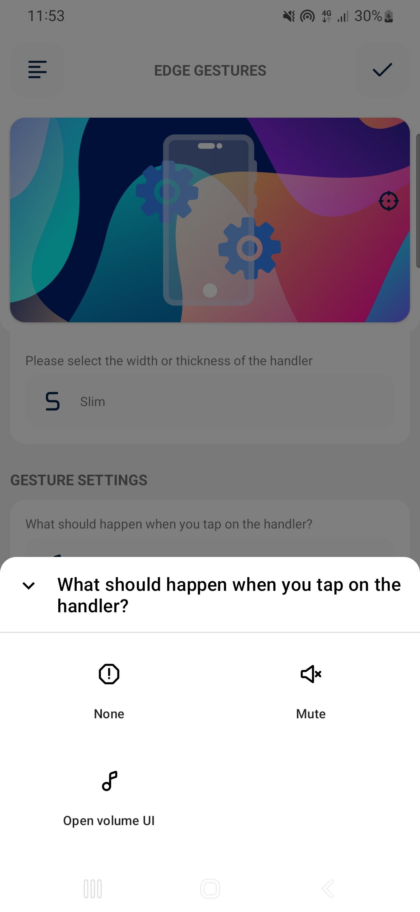
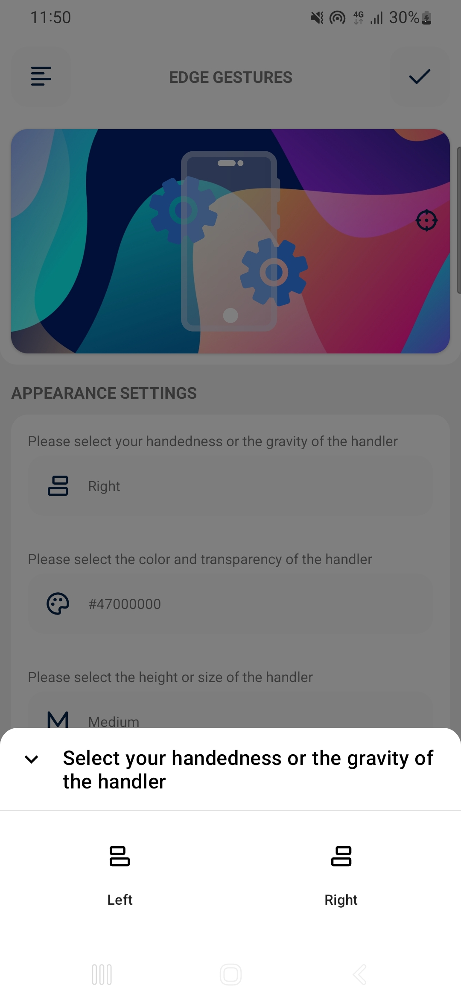
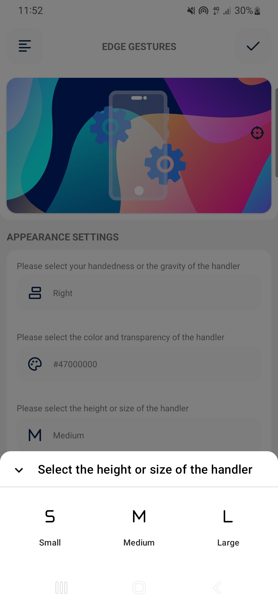

<h1 align="center">Edge Gesture Volume</h1>

  
  
  

  
Edge Gesture Volume is a feature-rich Android application that provides intuitive gesture-based volume control for your device. Enhance the longevity of the physical volume button by utilizing an intuitive edge gesture.

 

## Screenshots

|               Home                |         Gesture Settings          |       Samsung Volume Panel       |
|:---------------------------------:|:---------------------------------:|:--------------------------------:|
|             |  |          |
|         Application Menu          |            Color Sheet            |          Handler Action          |
|             |            |  |
|          Handler Gravity          |           Swipe Action            |          Handler Height          |
|  |    |  |

## 🔑 Key Features:
✓ Enhance the lifespan of your Volume button.
✓ Revitalize devices with faulty volume keys.
✓ Customize and style the volume gesture handler.
✓ Add click action to the volume gesture handler.
✓ Screen lock on the volume gesture handler click.
✓ Choose upper half swipe action in the volume gesture handler.
✓ Choose bottom half swipe action in the volume gesture handler.

## 🔏 App Permissions

✓ READ_EXTERNAL_STORAGE
✓ SYSTEM_ALERT_WINDOW
✓ FOREGROUND_SERVICE
✓ WAKE_LOCK
✓ RECEIVE_BOOT_COMPLETED

## 💕 Credit

Icons by [svgrepo.com](https://www.svgrepo.com/)
Lottie by [S M Rony](https://lottiefiles.com/110200-mobile-setting)

## 💻 Installation steps

Clone or download this project in your working directory, Open using android studio, Sync the
project, build & run the project.

## 🧑 Author

#### Md. Imam Hossain

You can also follow my GitHub Profile to stay updated about my latest projects:

If you liked the repo then kindly support it by giving it a star ⭐!

Copyright (c) 2023 MD. IMAM HOSSAIN
