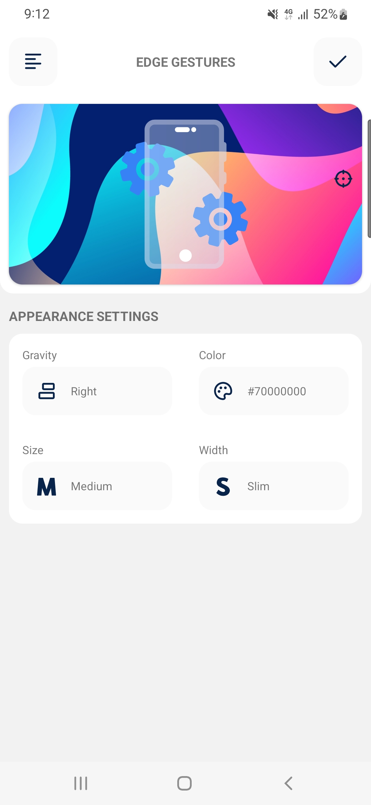
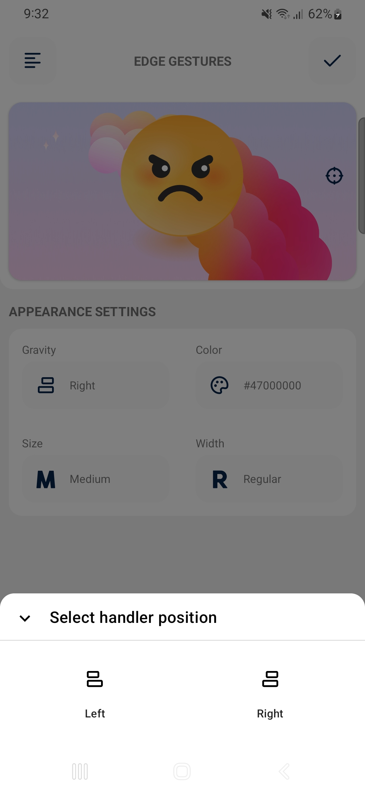
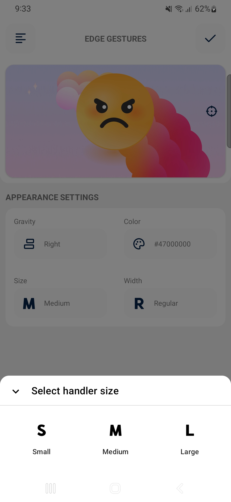
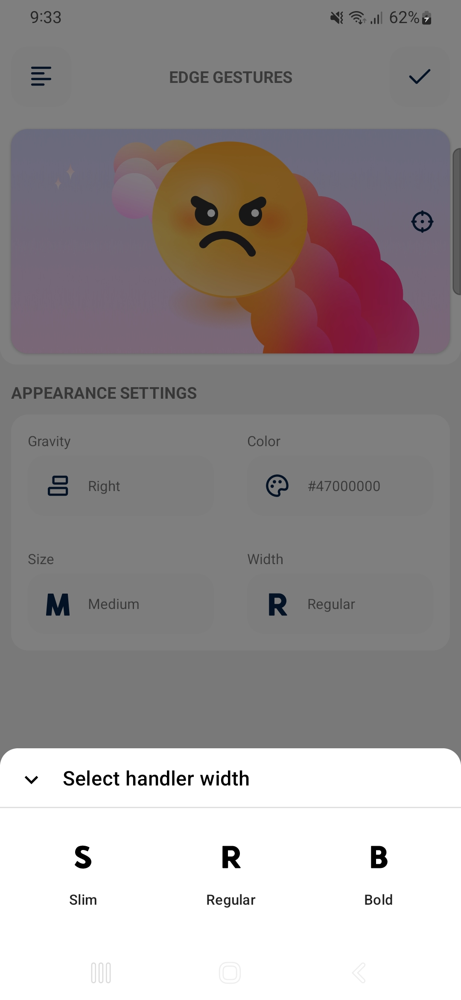
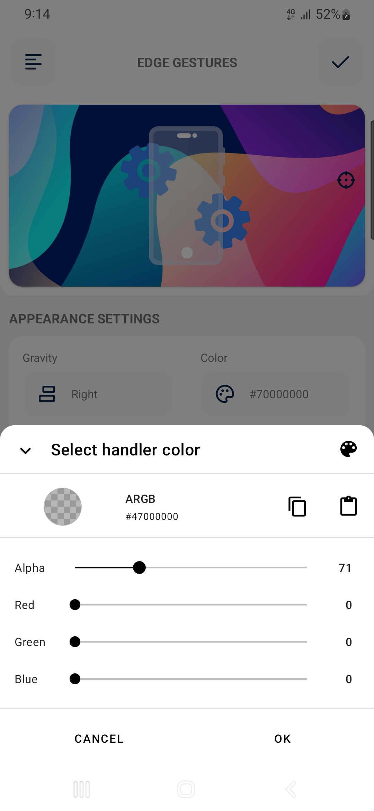

<h1 align="center">Edge Gesture Volume</h1>

  
  
  

  
Edge Gesture Volume is a feature-rich Android application that provides intuitive gesture-based volume control for your device. Enhance the longevity of the physical volume button by utilizing an intuitive edge gesture.

 

## Screenshots

|          Home          |          Menu          |          Gravity          |          Size          |
|:----------------------:|:----------------------:|:-------------------------:|:----------------------:|
|  |  |  |  |

|          Width          |          color          |            Home Preview            |            Home Preview            |
|:-----------------------:|:-----------------------:|:----------------------------------:|:----------------------------------:|
|  |  |  |  |

## 💻 Installation steps

Clone or download this project in your working directory, Open using android studio, Sync the
project, build & run the project.

## 🧑 Author

#### Md. Imam Hossain

You can also follow my GitHub Profile to stay updated about my latest projects:

If you liked the repo then kindly support it by giving it a star ⭐!

Copyright (c) 2023 MD. IMAM HOSSAIN
