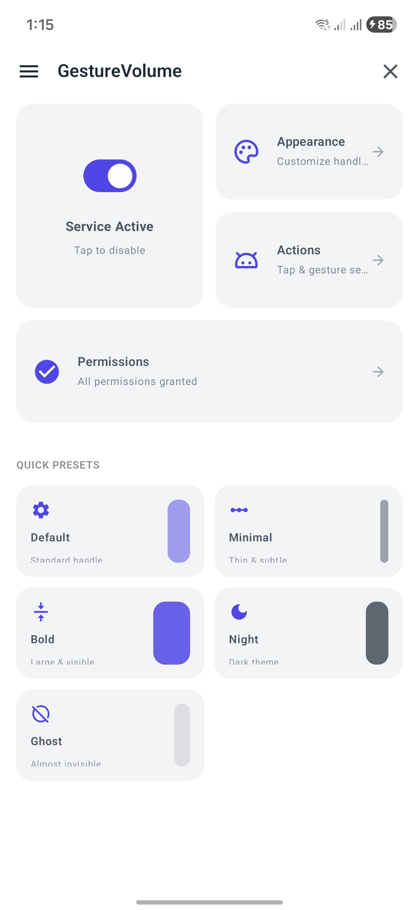
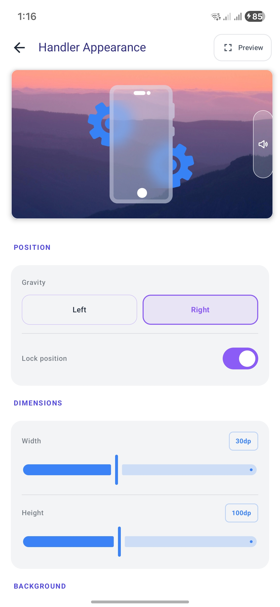
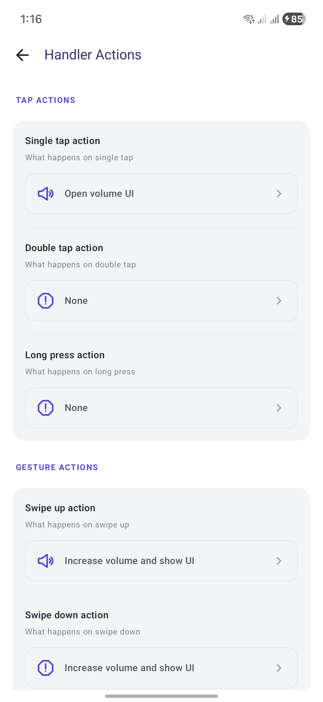
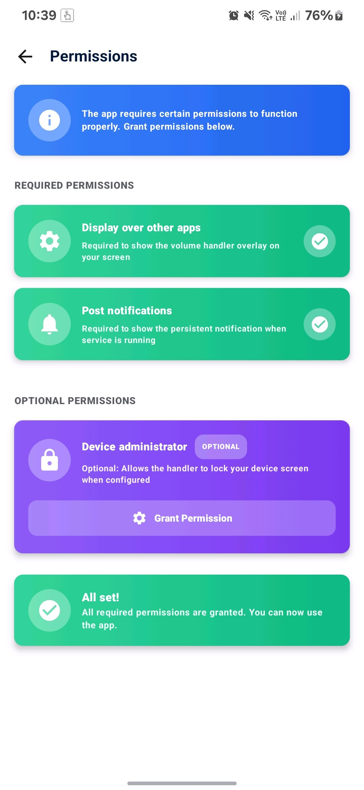
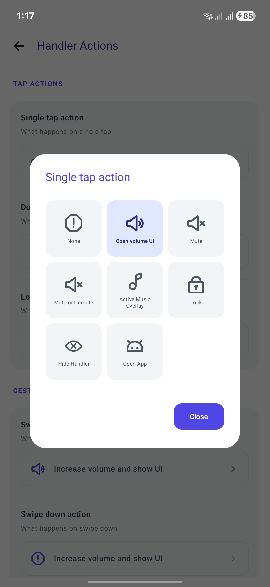

<h1 align="center">Gesture Volume — Jetpack Compose</h1>

<p align="center">
  
  
  
</p>

<p align="center">
Gesture Volume is a modern Android application built using <b>Jetpack Compose</b>, offering intuitive gesture-based volume control. Reduce wear on physical buttons by using a smooth and customizable edge-gesture volume slider.
</p>

<br>

<p align="center">

</p>

---

## 📌 About This Project

This repository contains the **Jetpack Compose version** of Gesture Volume.

👉 **Looking for the old XML-based version?**  
You can find it on the **main** branch.  

---

## 📸 Screenshots

|        Main Menu         |       Handler Appearance       |        Handler Actions        |
|:------------------------:|:------------------------------:|:-----------------------------:|
|  |  |  |

|       Permission Control       |           Available Actions           |
|:------------------------------:|:-------------------------------------:|
|  |  |

---

## 🔑 Key Features

- Preserve and extend the lifespan of your volume buttons.
- Useful on devices with damaged or faulty volume keys.
- Fully customize the gesture handler appearance.
- Add click actions to the gesture area.
- Lock the screen using a gesture-handler click.
- Assign separate actions to:
    - Upper-half swipe
    - Lower-half swipe

---

## 🔏 Permissions Used

- `READ_EXTERNAL_STORAGE`
- `SYSTEM_ALERT_WINDOW`
- `FOREGROUND_SERVICE`
- `WAKE_LOCK`
- `RECEIVE_BOOT_COMPLETED`

---

## 💻 Installation

1. Clone or download the repository.
2. Open the project in **Android Studio**.
3. Allow Gradle to sync.
4. Build & run the app.

---

## ⚙️ Configure `local.properties`

```env
APPLOVIN_SDK_KEY=<your-applovin-sdk-key>

AD_UNIT_APP_OPEN=<your-app-open-ad-unit-id>
AD_UNIT_INTERSTITIAL=<your-interstitial-ad-unit-id>
AD_UNIT_BANNER=<your-banner-ad-unit-id>
AD_UNIT_NATIVE=<your-native-ad-unit-id>

BASE64_PUBLIC_KEY=<your-play-store-base64-public-key>

PRODUCT_LIFETIME=<your-product-lifetime-id>
```

---

## 💕 Credits

- **Images:** [pexels.com](https://www.pexels.com/)
- **Icons:** [svgrepo.com](https://www.svgrepo.com/)
- **Lottie Animation:** [S M Rony](https://lottiefiles.com/110200-mobile-setting)

---

## 👨‍💻 Author
### **Md. Imam Hossain**

Stay updated with my latest projects:  
[](https://github.com/imamhossain94)

This project is **free to use, modify, and integrate** into your own applications.  
If you like this project, please support it by giving a **star ⭐**!

---

© 2025 Md. Imam Hossain — All Rights Reserved.

