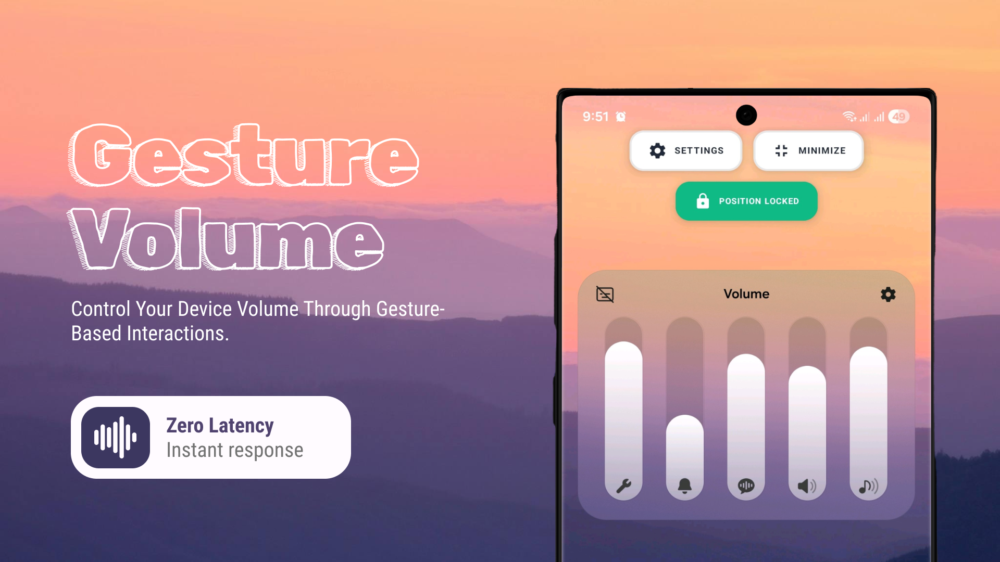

<h1 align="center">Gesture Volume — Jetpack Compose</h1>

<p align="center">
  
  
  
</p>

<p align="center">
A slim bar on the edge of your screen. Swipe it for volume or brightness, tap it for anything you
like, and pull it inward for <b>the Deck</b> — a slide-out panel of your apps, shortcuts and tools.
Built with <b>Jetpack Compose</b>.
</p>

<br>

<p align="center">

</p>

---

## 📌 About this repository

This is the **Jetpack Compose** version of Gesture Volume. The old XML version is on the **main**
branch.

---

## 🔑 Features

### The bar
- Swipe up and down for volume, or for screen brightness.
- Adaptive volume stream: follows a call, an alarm, a ringing phone, or media.
- The level is drawn on the bar while a swipe is moving it.
- Free placement on both axes, remembered per orientation, with optional snap-to-edge.
- Seven presets — Default, Minimal, Bold, Night, Ghost, Edge and Notch, the last being a slim bar
  across the top of the screen.
- Size, colour, opacity, corner radii, icon and edge distance are all adjustable, with a live
  preview you can drag and test before applying.

### Gestures
Six independent slots — single tap, double tap, triple tap, long press, swipe in, swipe out —
plus a long-press menu whose contents you choose. Around forty actions, grouped in the picker:

| Group | Actions |
| --- | --- |
| Handler | Move handler, open menu, hide handler, stop service, open app |
| Volume & brightness | Volume panel, mute, mute/unmute, music overlay, adaptive brightness |
| Deck & tools | Open deck, search, timer, calculator, notes, clipboard, media, coin, dice, QR, song search |
| Device | Flashlight, Do Not Disturb, auto-rotate |
| Media | Play/pause, next, previous |
| System | Lock screen, screenshot, Back, Home, recents, notifications, quick settings, power menu |

The System group needs the optional accessibility service; the picker badges those entries so
you know before you choose one.

### The Deck
A panel that slides out beside the bar.

- **Pinned apps** — as many as you like.
- **Quick dial** — one-tap call buttons, added from the system contact picker or typed by hand.
- **Search** — apps, contacts, arithmetic answered as you type, phone numbers routed to the
  dialler / SMS / WhatsApp / Telegram, and the web across seven providers. Voice search included.
- **Tiles** — volume, brightness, media transport, timer, calculator, notes, clipboard history,
  checklist, weather, QR scanner, song identification, screenshot, lock, flashlight, Do Not
  Disturb, auto-rotate, Wi-Fi, Bluetooth, coin toss and dice.
- Width, height, corner radius, colours, opacity, auto-close and tile order are all configurable,
  and every tile can be switched off.

### Two hosts, one bar
The overlay can be drawn by either service:

| | Foreground service | Accessibility service |
| --- | --- | --- |
| Needs "display over other apps" | yes | no |
| Ongoing notification | required by Android | none |
| System actions (lock, screenshot, …) | no | yes |
| Default | ✔ | opt-in |

`OverlayRuntime` routes every command to whichever host is up, and hands the bar over between
them without the user seeing a gap. `OverlayController` owns the bar, the gestures, the menu and
the Deck, so neither host carries a copy.

### Everything else
- 15 languages: English, Bangla, Arabic, Hindi, Korean, Japanese, Chinese, German, Spanish,
  French, Italian, Portuguese, Russian, Turkish, Vietnamese.
- Light, dark and system themes.
- A one-time Pro purchase removes ads.

---

## 🔏 Permissions

Required — **one** of:

| Permission | Why |
| --- | --- |
| `SYSTEM_ALERT_WINDOW` | Draws the bar, when the foreground service hosts it. |
| `BIND_ACCESSIBILITY_SERVICE` | Draws the bar without a notification, and performs the system actions. Optional, off by default. |

Requested at the moment the feature that needs it is switched on, and never before:

| Permission | Feature |
| --- | --- |
| `POST_NOTIFICATIONS` | The shade's Show / Settings / Stop row |
| `WRITE_SETTINGS` | Brightness and auto-rotate |
| `ACCESS_NOTIFICATION_POLICY` | The Do Not Disturb toggle |
| `READ_CONTACTS` | Contact search in the Deck |
| `CALL_PHONE` | Calling without stopping at the dialler |
| `ACCESS_COARSE_LOCATION` | The weather tile |

Always present, and unremarkable: `INTERNET`, `FOREGROUND_SERVICE`,
`FOREGROUND_SERVICE_SPECIAL_USE`, `VIBRATE`, `WAKE_LOCK`, `RECEIVE_BOOT_COMPLETED`.

`REQUEST_IGNORE_BATTERY_OPTIMIZATIONS` is deliberately **not** declared: the Troubleshoot screen
sends the user to the system battery list instead, which is the Play-policy-safe route for an app
of this type.

### What the accessibility service does

Three things, each of which the user opts into:

1. **System actions** — `GLOBAL_ACTION_LOCK_SCREEN`, `TAKE_SCREENSHOT`, `BACK`, `HOME`,
   `RECENTS`, `NOTIFICATIONS`, `QUICK_SETTINGS`, `POWER_DIALOG`. No other API reaches these.
2. **Hosting the overlay** without a notification.
3. **Clipboard capture**, off by default: it watches text selection and Copy presses so copied
   text lands in the app's own history, and pastes a chosen item back on request.

It subscribes to **zero** accessibility events unless clipboard capture is on — see
`GestureAccessibilityService.applyEventSubscription`. `isAccessibilityTool` is declared `false`:
this is a convenience feature, not an assistive tool. Nothing is collected or transmitted.

---

## 🏗 Architecture

```
service/
  OverlayRuntime            which host is drawing the bar, and how to reach it
  OverlayController         the bar, gestures, menu, indicator and Deck — shared by both hosts
  OverlayService            foreground host: notification, channels, service lifecycle
  GestureAccessibilityService  accessibility host: system actions, no-notification overlay, clipboard
  HandlerGeometry           where the bar goes; fractions, insets, snapping
overlay/
  OverlayComposeHost        lifecycle + saved-state owners so Compose can live in a Service window
  ContextMenuOverlay        the long-press menu
  deck/                     the Deck: tiles, cards, strip, search
ui/                         the app's own screens (Compose, Material 3)
utils/                      AudioStreamResolver, ExpressionEvaluator, SearchRouter, DeviceToggles…
data/local/                 SharedPref, DeckStore, SearchStore
```

The pure decision-making is deliberately free of Android types so it can be unit-tested on the
host JVM: `AudioStreamResolver` (which stream a swipe drives), `ExpressionEvaluator` (is this
arithmetic, and what does it come to), `SearchRouter` (is this a phone number, a sum, or a search)
and `ReviewPrompter` (should we ask for a review).

---

## 💻 Building

1. Clone the repository and open it in Android Studio.
2. `cp local.properties.example local.properties` and fill in the values.
3. Build and run.

`./gradlew assembleDebug -Psideload` builds a copy under `com.newagedevs.gesturevolume.sideload`
that installs **beside** a Play release, so testing never replaces the app on your own phone.

### `local.properties`

```env
APPLOVIN_SDK_KEY=<your-applovin-sdk-key>

AD_UNIT_APP_OPEN=<your-app-open-ad-unit-id>
AD_UNIT_INTERSTITIAL=<your-interstitial-ad-unit-id>
AD_UNIT_BANNER=<your-banner-ad-unit-id>
AD_UNIT_NATIVE=<your-native-ad-unit-id>

PRODUCT_LIFETIME=<your-product-lifetime-id>
```

Release signing is optional; see the comments in `local.properties.example`.

---

## 🏪 Store listing

`store/play-listing-en.md` holds the ready-to-paste Play Console copy, the Data safety answers and
the Accessibility API declaration, each checked against Google's character limits.

---

## 💕 Credits

- **Images:** [pexels.com](https://www.pexels.com/)
- **Icons:** [svgrepo.com](https://www.svgrepo.com/)
- **Lottie Animation:** [S M Rony](https://lottiefiles.com/110200-mobile-setting)
- **Weather:** [Open-Meteo](https://open-meteo.com/) — free, no API key, no attribution required

---

## 👨‍💻 Author
### **Md. Imam Hossain**

[](https://github.com/imamhossain94)

This project is **free to use, modify, and integrate** into your own applications.
If you like it, please leave a **star ⭐**!

---

© 2026 Md. Imam Hossain — All Rights Reserved.
